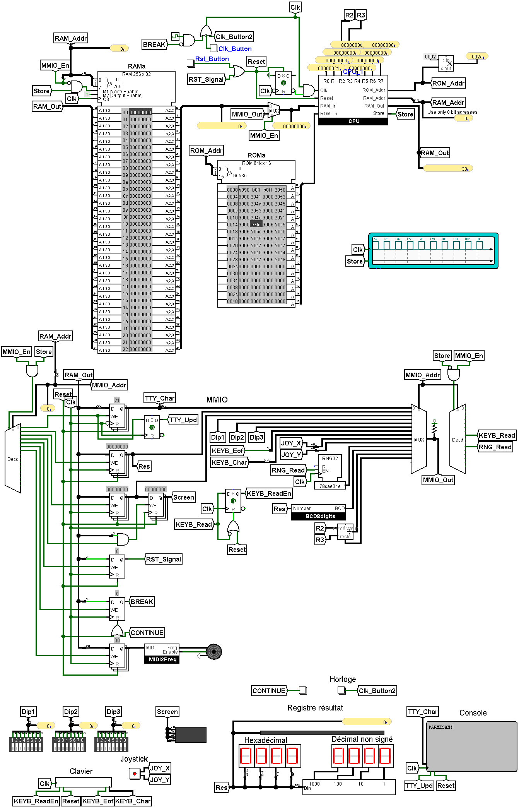

# parmesan

## Team

- Jinjin Wang
- Thomas Prévost
- Emmeline Vouriot
- Tom Niget

Featuring
- 32-bit address space
- Limited ARM support
   - Only SP-relative addressing
   - 16-bit PC
   - Only low (r0-r7) registers
- Memory-mapped Inputs/Outputs (MMIO)
   - DIP switches
   - Keyboard
   - 8x4 matrix screen
   - 7-seg number output
   - TTY output
   - Speaker (MIDI)
   - Analog stick
   - Hardware RNG
   - Hardware division/modulus
   - Hardware breakpoint support

